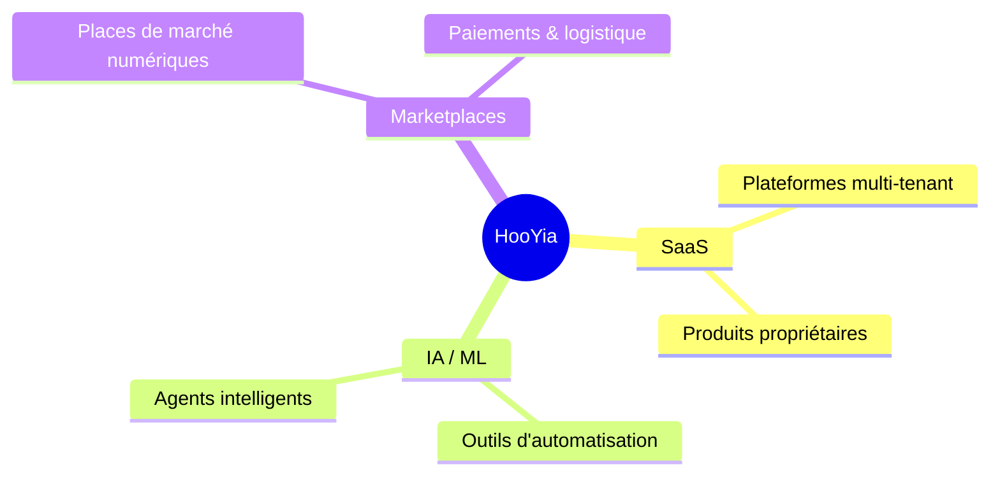
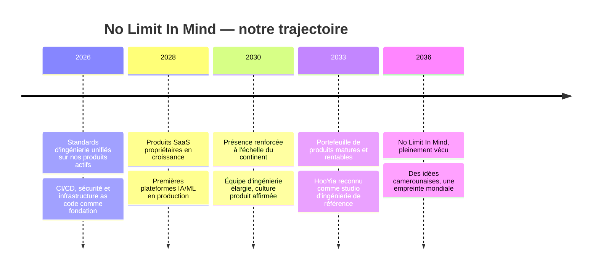

# HooYia

### No Limit In Mind

---

## 👋 Qui sommes-nous

HooYia est un studio d'ingénierie logicielle basé au Cameroun. Nous
concevons et opérons des plateformes SaaS, des outils IA/ML et des
marketplaces numériques.

**No Limit In Mind** n'est pas qu'une signature — c'est notre façon de
travailler : partir de problèmes réels, construire des produits qui
durent, et ne jamais considérer une limite comme définitive.

## 🧭 Nos piliers

## 🚀 Notre trajectoire

Une ambition, pensée sur la durée — pas des promesses, une direction.

## 🛠️ Comment on travaille

Nos dépôts actifs suivent un même standard, pas juste des bonnes
intentions :

- **Revue obligatoire** — aucune fusion sur `main` sans approbation de
  l'équipe technique (`CODEOWNERS` + règles de branche)
- **CI complète** — lint, types, tests, et scan de sécurité (SAST,
  dépendances, secrets, image conteneur, IaC) sur chaque Pull Request ;
  toute faille détectée ouvre une issue et bloque la fusion
- **Déploiement traçable** — versions sémantiques automatiques, chaque
  déploiement et rollback est un geste explicite et journalisé
- **Infrastructure as Code** — tout changement d'infrastructure passe
  par un plan Terraform relu avant d'être appliqué

## 👥 Équipe

| Équipe | Rôle |
|---|---|
| `tech-leads` | Revue et approbation des Pull Requests |
| `devbackend` | Développement backend et architecture |
| `devfrontend` | Développement frontend |
| `internproject` | Stagiaires et projets d'apprentissage |

## 💻 Stack principale

Python · Django · Terraform · AWS · GitHub Actions · PostgreSQL

---

*No Limit In Mind.*

